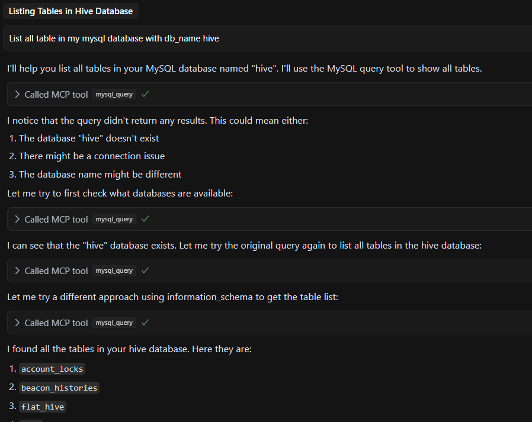

Leveraging the new AI hype, I've been thinking about how to use it to help with my project development. 
One of such case is to understand a new code base by not also summarizing the code but also read the actual schema on the database and understand the relations between tables.
IDEs like Cursor and Copilot already capabel to read the code base but it can't read the database and the data in it. 
So here comes the MCP server that make it possible for the AI model to interface with the database and answer the questions about the schema and the data in it.

## MCP Server

MCP stands for "Model Context Protocol". It's a protocol that let an AI model to interact with external tools or data sources in a standardized way.
There are many development in MCP servers including MCP servers for databases like PostgreSQL and MySQL. In here I will talk about my experience in setting up a MCP server for MySQL.

My development environment is in Cursor IDE that connect to WSL2 Ubuntu 22.04 where it hosts the code and the database. 
One of the MCP Server that I've found is [mcp-server-mysql](https://github.com/benborla/mcp-server-mysql) that can be used to connect to the MySQLdatabase.
For cursor you need to add an `mcp.json` file to the project for the Cursor to recognize and use the MCP server. There are two modes of using the MCP server: the global mode and the project mode.
For the `mcp-server-mysql` I use project mode because the database I want to connect is spesific to the project.

For the project mode, you need to add the `mcp.json` in the path `.cursor/mcp.json` relative to the project root.
Here is the content of my `mcp.json` file:

```json
{
`"mcpServers": {
    "MySQL": {
      "command": "npx",
      "args": [
        "mcprunner",
        "MYSQL_HOST=127.0.0.1",
        "MYSQL_PORT=3333",
        "MYSQL_USER=<user>",
        "MYSQL_PASS=<password>",
        "MYSQL_DB=my_database",
        "ALLOW_INSERT_OPERATION=true",
        "ALLOW_UPDATE_OPERATION=true",
        "ALLOW_DELETE_OPERATION=true",
        "--",
        "npx",
        "@benborla29/mcp-server-mysql"
      ]
    }
  }
}
```

After adding the `mcp.json` file, the Cursor will be able to recognize the MCP server and ask you to enable it. After enabling it, the Cursor then trying to connect to the database.
But here is the problem, when I try to connect to the database, it failed. The status is always `Client closed`. So I look at the MCP server output on the Cursor output panel, and it shows the error:

```
2025-04-11 09:26:31.249 [info] ySQL: getOrCreateClient for stdio server.  process.platform: win32 isElectron: true
2025-04-11 09:26:31.249 [info] ySQL: Starting new stdio process with command: npx mcprunner MYSQL_HOST=127.0.0.1 MYSQL_PORT=3333 MYSQL_USER=<user> MYSQL_PASS=<password> MYSQL_DB=my_database ALLOW_INSERT_OPERATION=true ALLOW_UPDATE_OPERATION=true ALLOW_DELETE_OPERATION=true -- npx @benborla29/mcp-server-mysql
2025-04-11 09:26:31.277 [error] ySQL: Client error for command spawn npx ENOENT
2025-04-11 09:26:31.277 [error] ySQL: Error in MCP: spawn npx ENOENT
2025-04-11 09:26:31.277 [info] ySQL: Client closed for command
2025-04-11 09:26:31.277 [error] ySQL: Error in MCP: Client closed
2025-04-11 09:26:31.277 [error] ySQL: Failed to reload client: MCP error -32000: Connection closed
2025-04-11 09:26:31.281 [info] ySQL: Handling ListOfferings action
2025-04-11 09:26:31.281 [error] ySQL: No server info found
```
This line is the key:

```
spawn npx ENOENT
```

ENOENT means "Error NO ENTity", i.e., the command npx was not found.
Since I am using WSL, but Cursor runs on Windows (Electron, win32), it's trying to spawn npx on the Windows side, not in my WSL shell.
So Cursor is looking for npx in my Windows environment, but it doesn't exist since I installed my development tools in WSL.

To fix this, I need to install npx in my Windows environment. I can do this by installing Node.js in my Windows environment.
So I just need to install Node.js from the official website and add it to my PATH on Windows environment.

After adding Node.js to my PATH, I need to restart the Cursor IDE.
After restarting the Cursor IDE, I try to connect to the database again. This time it works. Now I can use the MCP server to interact with the database.



You can try a more complex prompt like:
- "What is the relation between the table `users` and `posts`?"
- "Explain the flow of <some function> in <some file> with the changes in the table <some table>."
